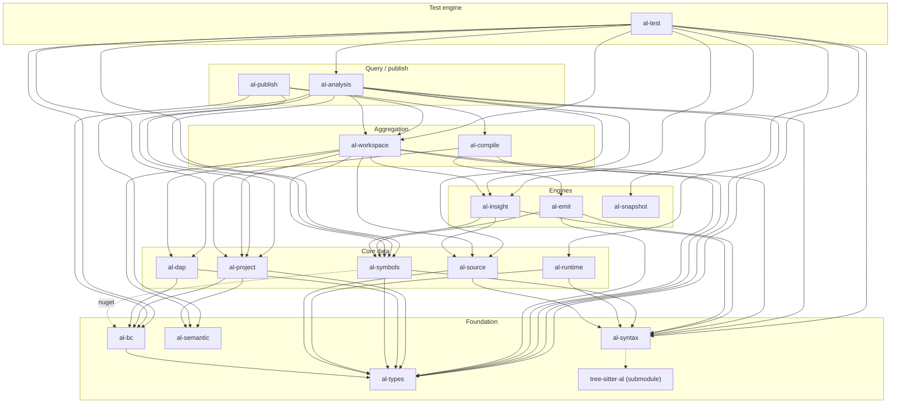
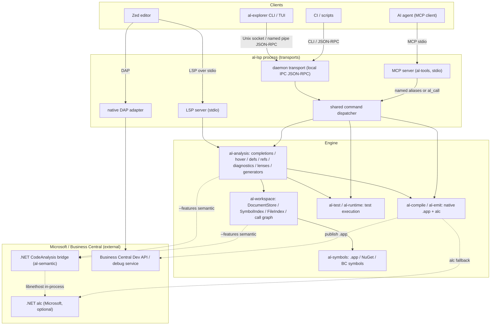

# Architecture diagrams: crates & request flow

Every edge below comes from the **`[dependencies]` tables in `crates/*/Cargo.toml`**
(direct Cargo path dependencies), and `crates/al-test-harness/tests/architecture_doc.rs`
fails when a solid arrow and the manifests disagree. `default`, optional, dev-only and
external edges are called out where they differ from a plain production dependency.

> Derive them again with `cargo metadata --no-deps` (or read the manifests).
> The tier grouping is for layout only. The arrows follow the manifests.

## Library crate layering

The engine crates and their **production** path-dependencies. Solid arrows are
normal `[dependencies]`. The dashed `nuget` arrow is the optional
`al-symbols → al-bc` edge (enabled by the default `nuget` feature). The dashed
`al-syntax → tree-sitter-al` arrow is the external grammar submodule (a path
dependency on a separate publishable crate, not a workspace member). The four
product/transport crates (`al-lsp`, `al-explorer`, `zed-al`, `al-test-harness`)
and `al-protocol` are shown in the next diagram.

Notes on edges that are **not** plain production dependencies (so they are
omitted above or drawn dashed):

- `al-symbols → al-bc` is **optional**, enabled by the default `nuget` feature
  (it turns on the NuGet/BC-server download path). `al-workspace`, `al-analysis`
  and `al-insight` depend on `al-symbols` with `default-features = false`, so
  they do **not** pull `al-bc` transitively.
- `al-syntax → tree-sitter-al` is the one path dependency on the grammar
  submodule, which has its own release cadence and is excluded from the
  workspace. Every other crate reaches the grammar through `al-syntax`.
- Dev-only `al-*` edges are left out: `al-dap` and
  `al-source` reference `al-syntax` under `[dev-dependencies]` (test fixtures).
  `al-source` and `al-runtime` also depend on it in production, so those arrows
  are drawn. `al-dap → al-syntax` is dev-only and is not.
- `al-snapshot` has no `al-*` dependency at all. It is drawn as a node with no
  outgoing arrow, which is what its manifest says.

## Product and transport crates

The crates users run, and the library layers each one links. `al-lsp`
is the single binary that re-exports the whole engine (LSP server + daemon + MCP
+ native DAP), so it depends on every library crate directly. `zed-al` (the WASM
extension) has **no** Cargo dependency on the engine and drives the compiled
binaries at runtime (dashed). `al-test-harness` drives the binaries the same
way. Its one production dependency is `al-protocol`, the client it uses to
identify and stop the daemons it starts. It also has dev-dependencies on eight
engine crates (`al-analysis`, `al-bc`, `al-compile`, `al-emit`, `al-project`,
`al-publish`, `al-test`, `al-workspace`) for in-process assertions, and those
edges are not drawn.

```mermaid
graph TD
  subgraph Products["Products / transports"]
    zed_al["zed-al (WASM extension)"]
    al_lsp["al-lsp (server + daemon + MCP + DAP)"]
    al_explorer["al-explorer (CLI / TUI)"]
    al_test_harness["al-test-harness"]
  end
  subgraph Lib["Library crates (engine)"]
    al_protocol["al-protocol"]
    al_types["al-types"]
    al_syntax["al-syntax"]
    al_semantic["al-semantic"]
    al_bc["al-bc"]
    al_source["al-source"]
    al_symbols["al-symbols"]
    al_runtime["al-runtime"]
    al_dap["al-dap"]
    al_project["al-project"]
    al_insight["al-insight"]
    al_emit["al-emit"]
    al_snapshot["al-snapshot"]
    al_compile["al-compile"]
    al_workspace["al-workspace"]
    al_analysis["al-analysis"]
    al_publish["al-publish"]
    al_test["al-test"]
  end

  al_lsp --> al_protocol
  al_lsp --> al_types
  al_lsp --> al_syntax
  al_lsp --> al_semantic
  al_lsp --> al_bc
  al_lsp --> al_snapshot
  al_lsp --> al_test
  al_lsp --> al_runtime
  al_lsp --> al_source
  al_lsp --> al_dap
  al_lsp --> al_project
  al_lsp --> al_symbols
  al_lsp --> al_emit
  al_lsp --> al_insight
  al_lsp --> al_compile
  al_lsp --> al_workspace
  al_lsp --> al_publish
  al_lsp --> al_analysis

  al_explorer --> al_protocol
  al_explorer --> al_types
  al_explorer --> al_emit
  al_explorer --> al_project
  al_explorer --> al_compile
  al_explorer --> al_symbols

  zed_al -.->|spawns al-lsp at runtime| al_lsp
  al_test_harness --> al_protocol
  al_test_harness -.->|drives binaries in tests| al_lsp
  al_test_harness -.->|drives binaries in tests| al_explorer
```

- `al-analysis` is linked by `al-lsp` with the `lsp` feature on (the
  `tower-lsp` wire conversions). `al-explorer` does not enable it.
- `al-lsp` is built **twice**: a plain `cargo build` links the no-op semantic
  stub, and `--features semantic` links the real in-process .NET CodeAnalysis
  bridge (see `make rust` and `make install`).
- `zed-al`, `al-explorer`, `al-lsp`, `al-protocol` and `al-test-harness` are
  `publish = false`. The remaining 17 library crates are publishable to
  crates.io.

## Request flow (editor → al-lsp → analysis / semantic)

How a request travels from a client through the `al-lsp` process into the engine
and out to the Microsoft/BC backends. The semantic-bridge edges are dashed
because they exist only in an `al-lsp` built `--features semantic`. Without it
those calls hit the in-memory stub and the native paths.

The four client transports are thin layers over one engine. CLI requests enter through the local
IPC daemon transport, and MCP calls the same command dispatcher in-process. `al_call` makes every
dispatcher method available, and the named tools are shortcuts to common ones. `al-analysis`
answers queries against the state `al-workspace` holds. The Microsoft `.NET CodeAnalysis` bridge
and the BC Dev API are reached only on the dashed, optional edges, so native parsing, symbols and
analysis work with no Microsoft toolchain installed.

See [testing-guide.md](./testing-guide.md) for how to verify each of these layers.
